<div align="center">

# 🩺 AI-Skin-Specialist

### Enterprise-Grade Asynchronous Multimodal Diagnostic Simulation, Speech-to-Text Transcription & Vocalization Gateway

**AI-Skin-Specialist** is a high-performance, full-stack multimodal diagnostic presentation layer built to stream patient vocal descriptions and visual skin matrices into advanced machine intelligence models. By utilizing non-blocking speech-to-text algorithms alongside decoupled text-to-speech synthesis pipelines, the platform transforms raw physical symptoms into structured, doctor-style auditory and textual clinical responses instantly—without UI interaction latency.

<p align="center">
  
  
  
  
  
</p>

<p align="center">
  <a href="https://github.com/shreeharsh-patil/ai-skin-specialist/stargazers"></a>
  <a href="https://github.com/shreeharsh-patil/ai-skin-specialist/issues"></a>
  <a href="LICENSE"></a>
</p>

</div>

> [!CAUTION]
> **&#x26A0;&#xFE0F; General Informational Guidance Only**
>
> This application functions strictly as a diagnostic simulator for educational research and structural portfolio validation. **It does not provide actual medical diagnoses, prescriptions, or clinical treatments.** See the [Medical Disclaimer & Liability Mapping](#-medical-disclaimer--liability-mapping) block before deployment.

---

## &#x1F3DB;&#xFE0F; System Architecture & Multimodal Design Pattern

Standard clinical automation pipelines frequently suffer from blocking events when dealing with concurrent audio/video streaming, high-resolution visual parsing, and synchronous API lookups. 

AI-Skin-Specialist handles this via an **Asynchronous Pipeline Decoupling Pattern**. The application isolates microphone/video transport structures from processing matrices, ensuring that heavy machine learning inferences, audio transcodes via FFmpeg, and Deepgram voice generation loops operate in non-blocking worker threads.

```mermaid
graph TD
    subgraph Client Application Layer
        A["&#x1F3A8; Gradio Web Shell <br><i>(Input Framework Interface)</i>"]
        B["&#x1F399;&#xFE0F; Audio/Video Capture Bridge <br><i>(Hardware Interface)</i>"]
    end

    subgraph Dynamic Ingestion & Processing Core
        C["&#x1F50C; Audio Decoder Core <br><i>(Pydub / PortAudio Buffer)</i>"]
        D["&#x2699;&#xFE0F; Speech-to-Text Gateway <br><i>(Groq Whisper API Engine)</i>"]
        E["&#x1F441;&#xFE0F; Image Preprocessor <br><i>(Pillow Matrix Scaling)</i>"]
    end

    subgraph Deep Learning Inference Mesh
        F["&#x1F9E0; Cognitive Analysis Matrix <br><i>(Groq Vision / MiniMax Engine)</i>"]
        G["&#x1F50A; Vocal Synthesis Layer <br><i>(Deepgram SDK Audio Engine)</i>"]
    end

    A <-->|User Activity Intercepts| B
    B <-->|Multi-part Stream Buffers| C
    C <-->|Sanitized Audio Data| D
    B <-->|Base64 Data Matrix| E
    D & E -->|Unified Prompt Payload| F
    F -->|Raw Diagnosis Strings| G
    G --> H["&#x1F4BE; Clinical Audio Artifact (.mp3)"]
    H --> A

    style A fill:#FF7C00,stroke:#cc6600,stroke-width:2px,color:#fff
    style B fill:#34B7F1,stroke:#209CEE,stroke-width:2px,color:#fff
    style C fill:#9b59b6,stroke:#8e44ad,stroke-width:2px,color:#fff
    style D fill:#F55036,stroke:#d42a11,stroke-width:2px,color:#fff
    style E fill:#e74c3c,stroke:#c0392b,stroke-width:2px,color:#fff
    style F fill:#f1c40f,stroke:#f39c12,stroke-width:2px,color:#333
    style G fill:#00A3E0,stroke:#00719c,stroke-width:2px,color:#fff
```



> [!NOTE]
> **Data Scrape Strategy**: Rather than pushing massive raw visual payloads directly to standard vision API vectors, high-resolution snapshots are downsampled via strict mathematical scaling calculations down to a maximum envelope of 1024x1024 pixels. This structural step guarantees sub-second network transportation times while maintaining critical feature resolution.

### &#x1F504; End-to-End Consultative Lifecycle

The sequence blueprint below displays the decoupled, step-by-step path from patient speech input to localized visual analysis and final vocal output generation:

```mermaid
sequenceDiagram
    autonumber
    actor User as Patient Operator
    participant UI as Gradio Shell interface
    participant PV as Patient Voice Pipeline
    participant DB as Doctor Brain Module
    participant DV as Doctor Voice Engine
    participant API as External Model Providers

    User->>UI: Input Image/Video + Record Audio Description
    UI->>PV: Pass Local Microphone Audio File Stream
    PV->>API: Execute Fast Groq Whisper Speech-to-Text Call
    API-->>PV: Return Sanitized Structural Transcript String
    PV-->>UI: Populate Web Text Input Fields
    
    rect rgb(30, 20, 40)
        note over UI,DB: Multimodal Context Packaging
        UI->>DB: Dispatch Text Prompt + Pillow Image Byte Array
        DB->>DB: Evaluate Provider Enforcer (Groq Vision vs. MiniMax M3)
        DB->>API: Transmit Multimodal Context Array
        API-->>DB: Yield Doctor Guidance Text Payload
    end

    rect rgb(20, 30, 20)
        note over DB,DV: Audio Generation Pipeline
        DB->>DV: Forward Doctor Text Response String
        DV->>API: Trigger Deepgram TTS Audio Stream Processing
        API-->>DV: Stream Clean Audio Byte Output (.mp3)
        DV-->>UI: Write Target doctor_response.mp3
    end

    UI-->>User: Render Interactive Visual Analytics Charts & Vocal Playback
```



## &#x1F6E0;&#xFE0F; Operational Pipeline Implementation

| Component | The Production Challenge | Our Solution Architecture |
|---|---|---|
| &#x1F399;&#xFE0F; Audio Ingestion | Raw hardware microphone captures frequently hit PortAudio compiler errors or mismatched channel rates. | Enforces a system pre-install layer paired with pydub sanitization checks to catch and normalize varying channel depths before transmission. |
| &#x1F441;&#xFE0F; Image Scaling | Large image payloads block the web gateway threads and exhaust remote processing API payload caps. | Automatically processes user inputs through an isolated Pillow pipeline, converting formats to normalized JPEG spaces. |
| &#x1F9E0; Model Fallbacks | Vision models frequently experience service traffic spikes, causing request failures. | Implements a variable provider environment layout (`AI_PROVIDER`) allowing seamless failover routing to MiniMax endpoints. |
| &#x26A1; Non-Blocking UIs | Processing multi-tier model connections sequentially freezes user interface loops. | Isolates long network operations into separate background threads, allowing the Gradio engine to update state fields independently. |

## &#x1F4E6; System Installation Requirements

### System Pre-requisites

- **Runtime Isolation Engine**: Python >= 3.11
- **Binary Processing Utilities**: Global accessibility configurations to FFmpeg and PortAudio.
- **Package Architecture Core**: `uv` modern virtual environment manager.

### macOS (via Homebrew)

```bash
brew update
brew install ffmpeg portaudio
```

### Windows (via Chocolatey / Scoop)

```powershell
# Run from Administrator PowerShell
choco install ffmpeg portaudio
# Alternatively using Scoop: scoop install ffmpeg portaudio
```

### Linux (Ubuntu/Debian / Fedora / Arch)

```bash
# Debian/Ubuntu
sudo apt update && sudo apt install ffmpeg portaudio19-dev python3-dev build-essential

# Fedora
sudo dnf install ffmpeg portaudio-devel python3-devel gcc gcc-c++ make

# Arch
sudo pacman -S ffmpeg portaudio base-devel
```

## &#x1F680; Environment Setup Sequences

### 1. Repository Instantiation & Environment Configuration

```bash
# Clone the repository core
git clone https://github.com/shreeharsh-patil/ai-skin-specialist.git
cd ai-skin-specialist

# Install uv package ecosystem manager if not present locally
# macOS/Linux: curl -LsSf https://astral.sh/uv/install.sh | sh
# Windows: irm https://astral.sh/uv/install.ps1 | iex

# Synchronize virtual project spaces and generate lock profiles
uv sync
```

### 2. Local Environment Allocation

Construct a project root `.env` profile using the structure variables shown below:

```ini
GROQ_API_KEY=your_groq_api_key_here
DEEPGRAM_API_KEY=your_deepgram_api_key_here

# Structural Model Implementations
WHISPER_MODEL=whisper-large-v3
GROQ_MODEL=meta-llama/llama-4-scout-17b-16e-instruct
DEEPGRAM_TTS_MODEL=aura-2-thalia-en

# Alternate Provider Layer Strategy (MiniMax Fallback Routing)
AI_PROVIDER=groq # Toggle to "minimax" for fallback activation
MINIMAX_API_KEY=your_minimax_api_key_here
MINIMAX_BASE_URL=https://api.minimax.io/anthropic
MINIMAX_MODEL=MiniMax-M3
```

### 3. Execution Pipeline Initialization

```bash
# Bootstrap the application client shell using the uv runtime module
uv run python main.py
```

Gradio will expose a local runtime boundary, typically accessible via: `http://127.0.0.1:7860`

## &#x1F4C1; Framework Directory Architecture

```
ai-skin-specialist/
├─ main.py                          (Gradio core initialization framework & interface bindings)
├─ patient_voice.py                 (Microphone buffer interceptors & Groq Whisper STT client)
├─ doctor_brain.py                  (Cognitive reasoning layers: Manages Groq/MiniMax routing rules)
├─ doctor_voice.py                  (Deepgram TTS SDK integration layer parsing audio files)
├─ pyproject.toml                   (Python package environment configurations and metadata parameters)
├─ uv.lock                          (Fully locked immutable dependency array map)
├─ .python-version                  (Target standard operational Python system selector)
├─ sample.env                       (Operational blueprint template environment layout)
└─ README.md                        (Unified platform system documentation)
```

## &#x2696;&#xFE0F; Medical Disclaimer & Liability Mapping

> [!WARNING]
> This platform functions strictly as an educational software demonstration and technical research portfolio piece. It is not an officially verified clinical utility, does not hold healthcare provider certifications, and cannot produce binding medical diagnoses. The code models do not replace professional assessments by a licensed dermatologist or clinical physician. Users assume absolute liability regarding data transit compliance paths, privacy rules for sensitive tracking images, and operational usage limitations.

## &#x1F464; Project Author

**Developed and Maintained by Shreeharsh Patil.**

Feel free to contact me or submit issues via:

- **Email**: shreeharsh.dev@gmail.com
- **GitHub Profile**: [github.com/shreeharsh-patil](https://github.com/shreeharsh-patil)
